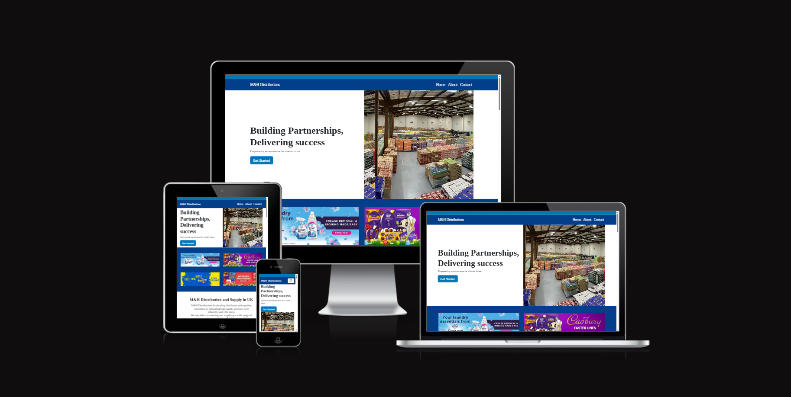
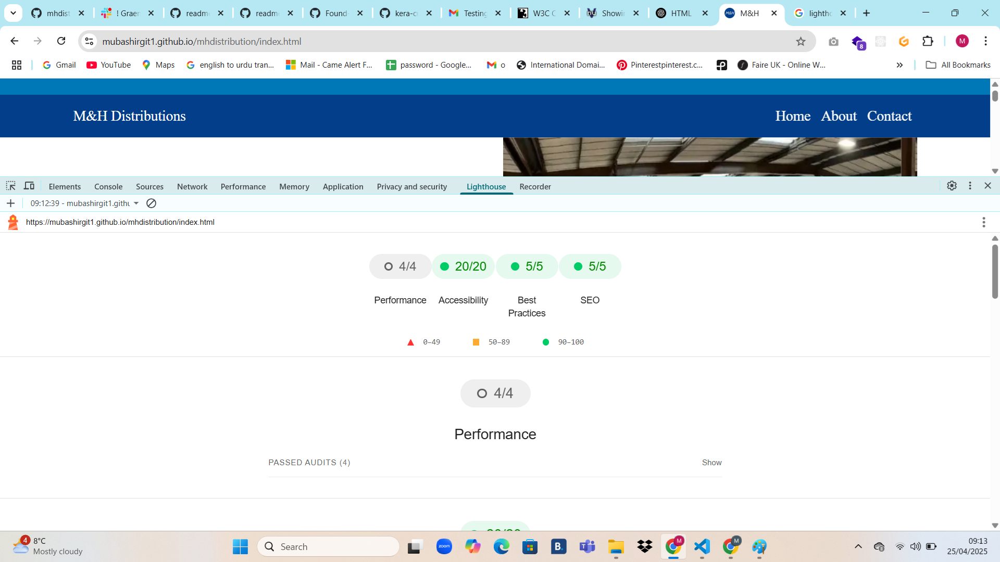
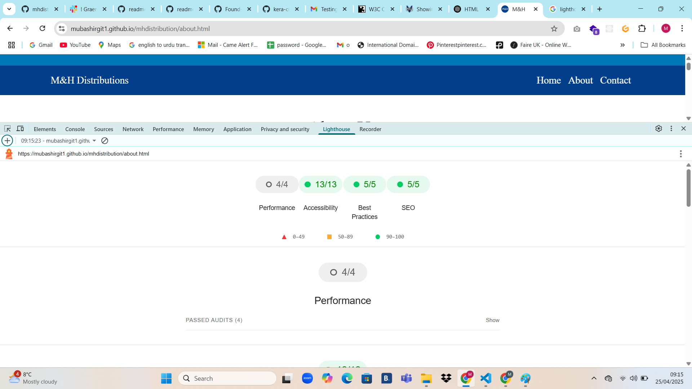
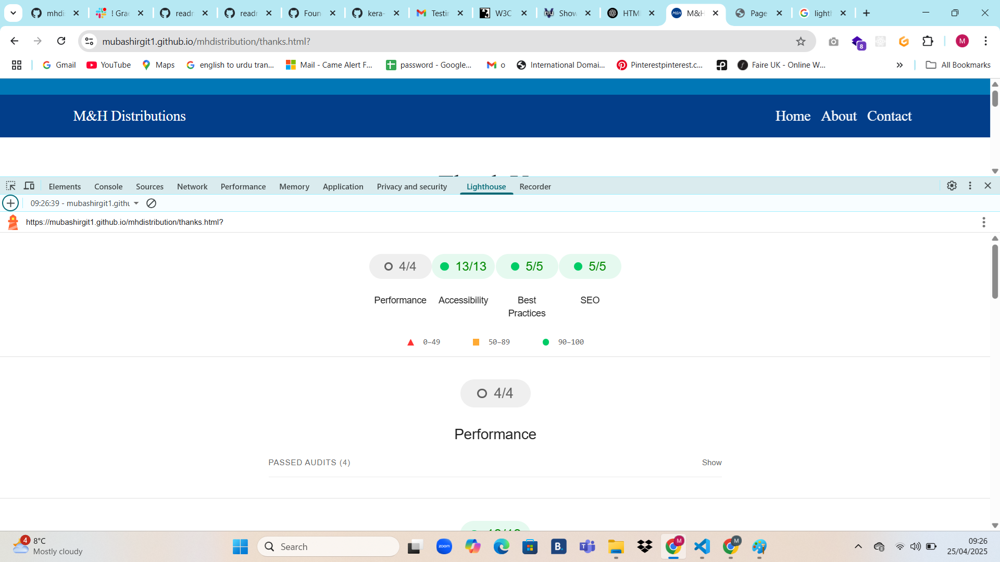
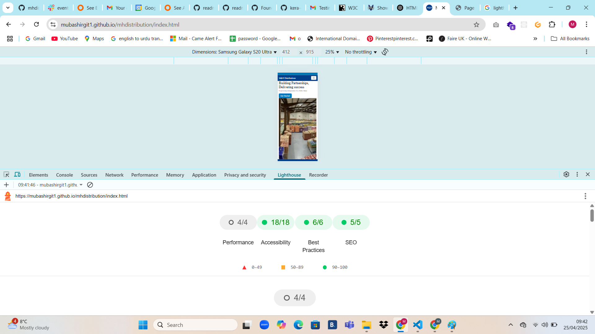
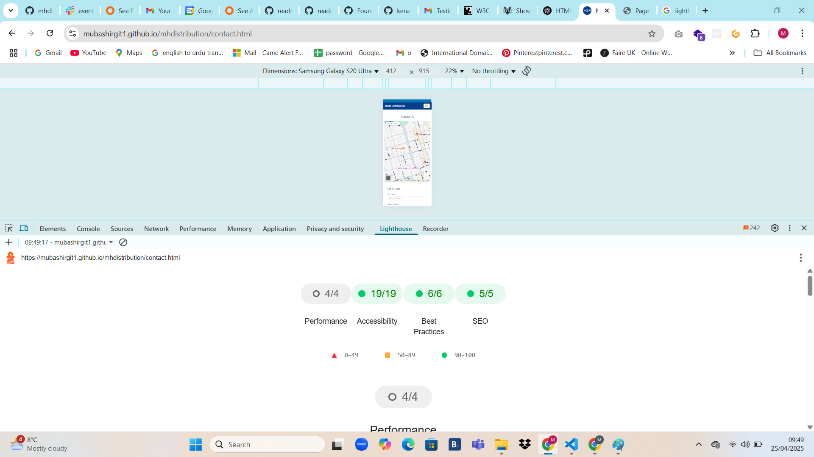
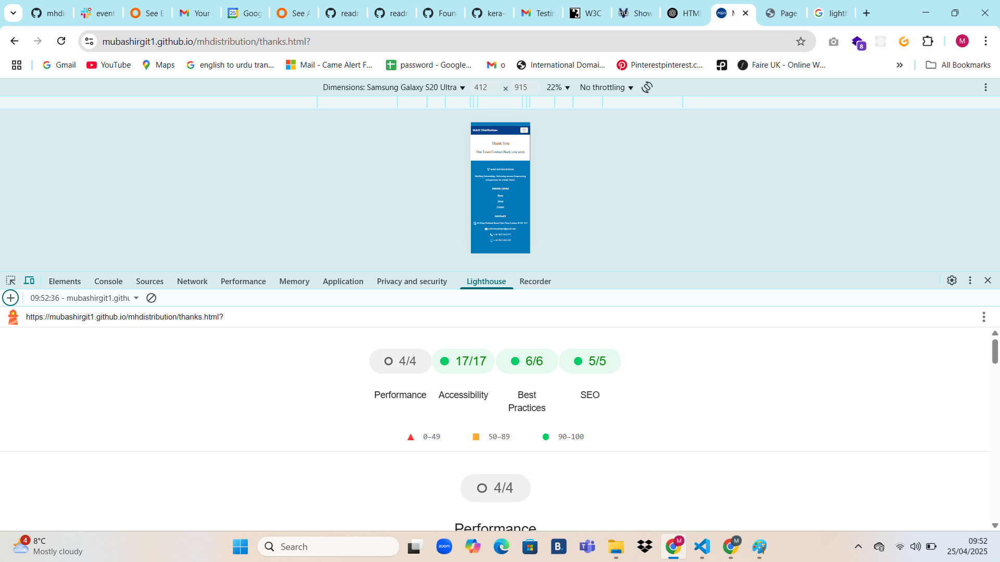

# M&H DIstributons -  Testing Documentation

Visit the deployed site: [M&H Distribution](https://mubashirgit1.github.io/mhdistribution/)

- - -

## CONTENTS

* [AUTOMATED TESTING](#AUTOMATED-TESTING)
  * [W3C Validator](#W3C-Validator)
  * [W3C CSS MarkUP Validator ](#W3C-CSS-Validator)
  * [Lighthouse](#Lighthouse)
* [MANUAL TESTING](#MANUAL-TESTING)
  * [Testing User Stories](#Testing-User-Stories)
  * [Full Testing](#Full-Testing)

Testing was ongoing throughout the entire build. We utilised Chrome developer tools whilst building to pinpoint and troubleshoot any issues as we went along.

Each page has been inspected using google chrome developer tools & Firefox inspector tool to ensure that each page is fully responsive on a variety of different screen sizes and devices. We have also physically tested the responsiveness of the site on a number of different devices.

- - -

## AUTOMATED TESTING

### W3C Validator

[W3C](https://validator.w3.org/) was used to validate the HTML on all pages of the website. It was also used to validate the CSS.

A warning relating to the use of the aria-label in the `<i>` tag was flagged as being a possible misuse of the label. This is due to the bootstrap class for the icons to allow the icons to be accessible friendly (taken from the documentation for bootstrap5), and can therefore be ignored.
__Update April 2025__
Further research into this matter suggests that moving the aria-label into the parent `<a>` tag will remove the above error relating to the misuse of the label.
An Error to remove pixel unit from width and height of img attritbute from our project 
* [Index Page W3C HTML Validation](https://validator.w3.org/nu/?doc=https%3A%2F%2Fmubashirgit1.github.io%2Fmhdistribution%2F) - Pass

* [Index Page W3C HTML Validation image](documentation/testing/index-html-v.png) - Pass

* [About US W3C HTML Validation](https://validator.w3.org/nu/?doc=https%3A%2F%2Fmubashirgit1.github.io%2Fmhdistribution%2Fabout.html) - Pass

* [About Page W3C HTML Validation image](documentation/testing/index-html-v.png) - Pass

* [Contact US Page W3C HTML Validation](https://validator.w3.org/nu/?doc=https%3A%2F%2Fmubashirgit1.github.io%2Fmhdistribution%2Fcontact.html) - Pass

* [Contact Page W3C HTML Validation image](documentation/testing/contact-html-v.png) - Pass

* [Thanks Page W3C HTML Validation](https://validator.w3.org/nu/?doc=https%3A%2F%2Fmubashirgit1.github.io%2Fmhdistribution%2Fthanks.html%3F) - Pass

- - -

### W3 CSS Validator

[jigsaw.w3](https://jigsaw.w3.org/css-validator) was used to validate the Cascading styling sheet.

* [style.css CSS Validation](documentation/testing/css-validation.png) - Pass

- - -

### Lighthouse

I used Lighthouse within the Chrome Developer Tools to test the performance, accessibility, best practices and SEO of the website.

### Desktop Results

* Index Page
  

* About Page
  
  
* Contact Page
  
  
* Thank you Page
  

### Mobile Results

* Index Page
  

* About Page
  
  
* Contact Page
  
  
* Thank you Page
  

- - -

## MANUAL TESTING

### Testing User Stories

Testing was ongoing throughout the entire build. I utilised Chrome developer tools while building to pinpoint and troubleshoot any issues as I went along.

The following issues were raised during my mid project meeting with my mentor:

-   **Meta Tags Are Missing**: Essential **meta tags** (such as title, description, and keywords) should be included in the `<head>` section for SEO and better website visibility.
    
-   **Images Alternative Text Needs Improvement**: The **alt text** for images should be more descriptive and meaningful to provide better accessibility and SEO benefits. It should clearly describe the image content for screen readers and search engines.
    
-   **Convert All Images to WebP Format**: Using **WebP** instead of traditional formats (JPEG/PNG) helps **reduce file sizes** while maintaining high quality, improving page load speed and performance.
    
-   **Toggle Button Not Clear for Users**: The **navbar toggle button** should be more **visible and user-friendly**, possibly by adjusting its size, contrast, or adding an icon label to indicate its function.
    
-   **Code Formatting**: The code should be properly **formatted, indented, and structured** for readability and maintainability. Well-organized code makes debugging and future updates easier.
    
-   **Remove Unused Links**: Any **broken, unused, or irrelevant links** should be removed to keep the website clean, functional, and user-friendly. This avoids confusion and improves navigation.  

The following issues were raised during my mid project meeting with my mentor:

-   **Meta Tags Are Missing**: Essential **meta tags** (such as title, description, and keywords) should be included in the `<head>` section for SEO and better website visibility.
    
-   **Images Alternative Text Needs Improvement**: The **alt text** for images should be more descriptive and meaningful to provide better accessibility and SEO benefits. It should clearly describe the image content for screen readers and search engines.
    
-   **Convert All Images to WebP Format**: Using **WebP** instead of traditional formats (JPEG/PNG) helps **reduce file sizes** while maintaining high quality, improving page load speed and performance.
    
-   **Toggle Button Not Clear for Users**: The **navbar toggle button** should be more **visible and user-friendly**, possibly by adjusting its size, contrast, or adding an icon label to indicate its function.
    
-   **Code Formatting**: The code should be properly **formatted, indented, and structured** for readability and maintainability. Well-organized code makes debugging and future updates easier.
    
-   **Remove Unused Links**: Any **broken, unused, or irrelevant links** should be removed to keep the website clean, functional, and user-friendly. This avoids confusion and improves navigation.  

### Full Testing

Full testing was performed on the following devices:

* Laptop:
  * Intel Premium Aspire 3 14 inch screen
* Mobile Devices:
  * iPhone 13 pro.
  * iPhone 11 pro.
  * Phone X.

Each device tested the site using the following browsers:

* Google Chrome
* Safari
* Firefox

Additional testing was taken by friends and family on a variety of devices and screen sizes.  

Feature | Expected Outcome | Testing Performed | Result | Pass/Fail |
| --- | --- | --- | --- | --- |
| `Navbar` |
| Site logo | Redirects to the home page | Click logo |  Redirects to home page | Pass |
| Site Name | Redirects to home page | Click site name | Redirects to home page | Pass |
| Home Link | Redirects to home page | Click home link | Redirects to home page | Pass |
| About Link User go to about us informaton  | Pass |
| Contact Link User can see contact us page and all information to contact us | Pass |
| Thanks Page user submit form and fill all fields then move to Thanks Page | Pass |
| Admin View | Redirects to the admin view page | Click admin view link | Redirected to admin view page | Pass |
| Logout link (user logged in) | User will be logged out | Click log out link| Redirected to home page - login link available | Pass |
| `Home Page` |
| View threads button | Redirects to the threads page | Click button | Redirected to the thread | Pass |
| Start a new thread button | Modal popup to create new thread | Click button | New thread modal popped up | Pass |
| `Login Page` |
| Form - link to sign up page | Redirects user to sign in page | Click link | Redirected to sign up page | Pass |
| Form - Submission with no information | User prompted to fill in information | clicked submit button with no fields filled out | Form highlighted first empty field | Pass |
| `Signup Page` |
| Form - Submission with no information | User prompted to fill in information | clicked submit button with no fields filled out | Form highlighted first empty field | Pass |
| `Footer` |
| Footer - Home | Redirects Home | Click button |  Pass |
| Footer - About links | Redirect to About |  Pass |
| Footer - Contact | Redirects to Contact |  Pass |
| footer - Logo | Redirects to the Home |  Pass |

Back to [README.md](README.md)